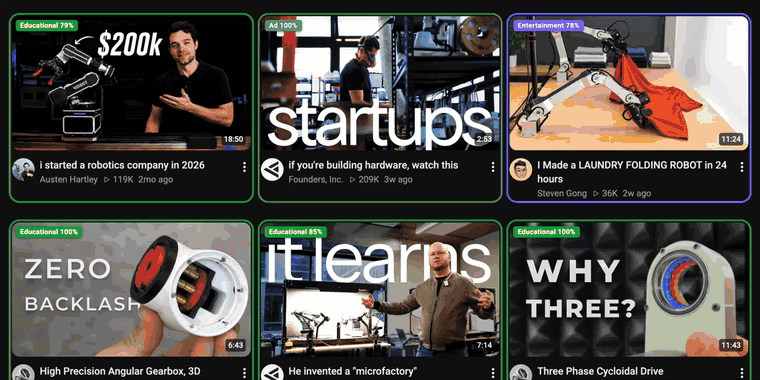

<p align="center">
  
</p>

<h1 align="center">JevTube</h1>

<p align="center">
  <b>Know what a YouTube video really is before you click.</b><br>
  Every video gets a colored label: slop, clickbait, news, educational… or categories you invent.
</p>

<p align="center">
  <a href="https://github.com/akshatnerella/jevtube/releases/latest/download/jevtube.zip"><b>⬇ Download</b></a> ·
  <a href="#install">Install</a> ·
  <a href="docs/demo.mp4">Full-quality demo</a> ·
  <a href="https://jev-backend.vercel.app/jevtube/privacy.html">Privacy</a>
</p>

<p align="center">
  
</p>

## What it does

JevTube draws a colored box around every video on YouTube (home feed, the sidebar while you watch, search results, Shorts shelves, channel pages) and labels it within about a second as you scroll.

| Label | What it catches |
|---|---|
| 🟥 **Slop** | AI-generated filler, content farms, reuploads, faceless "facts" channels |
| 🟧 **Clickbait** | Titles built to bait you: ALL CAPS, "you won't believe", fake curiosity gaps |
| 🟦 **News** | Current, time-sensitive news coverage |
| 🟩 **Educational** | Lectures, tutorials, explainers, documentaries |
| 🟪 **Entertainment** | Vlogs, gaming, comedy, podcasts, sports, reviews |
| 🩷 **Music** | Music videos, songs, live performances, mixes |
| 🩵 **Ad** | Sponsored placements and promo content (blurred by default) |

- **Make your own categories.** Want to spot drama, true crime, reaction videos or finance hype? Add up to 12 of your own, describe them in plain English, and JevTube sorts your feed by them. There are one-click suggestions too.
- **Choose what each one does:** **Box** it, **Dim** it, **Blur** it until you click, **Hide** it, or turn it **Off**. For example: hide slop, dim clickbait, blur ads.
- **Ads stay out of your way.** Anything YouTube itself marks as sponsored is blurred behind a "click to show" cover.
- **⚡bait** flags a clickbait-style title even on an otherwise legit video.
- **Honest uncertainty.** A dashed box means the model isn't sure; hover any label to see the full breakdown.
- **Full context.** Each video is judged on its title, channel, description, tags, YouTube category and stats, not just the title.

## Install

> Chrome Web Store listing coming soon. Until then, it takes about two minutes:

1. **Download** [`jevtube.zip`](https://github.com/akshatnerella/jevtube/releases/latest/download/jevtube.zip) and **unzip** it (double-click on Mac). You'll get a `jevtube` folder.
2. Open your browser's extensions page:
   - Chrome: `chrome://extensions`
   - Brave: `brave://extensions`
   - Edge: `edge://extensions`
   - Arc: `arc://extensions`
3. Turn on **Developer mode** (top-right toggle).
4. Click **Load unpacked** and select the unzipped `jevtube` folder.
5. Open [YouTube](https://www.youtube.com). Labels appear as you scroll. 🎉

Keep that folder somewhere permanent (not Downloads), because the browser loads JevTube from it. **To update:** download the new zip, replace the folder's contents, and click ↻ on the JevTube card.

## Using it

- **Toolbar popup:** live counts for the current page, a quick Box/Dim/Blur/Hide/Off switch per category, and an on/off toggle. Pin JevTube from the puzzle-piece menu so it's one click away.
- **Settings page** (popup → *Edit categories*): add, rename, recolor and describe categories; **test any title** to see how it would be labeled before you browse; display options.
- **Shortcut:** <kbd>Alt</kbd>+<kbd>Shift</kbd>+<kbd>S</kbd> turns JevTube on or off anywhere.

## How it works

JevTube is powered by [**Jev**](https://docs.typesafe.ai), a fast decision model from TypeSafe AI that returns typed answers with calibrated probabilities instead of generating text. Visible videos are sent in small batches to a hosted backend (`jev-backend.vercel.app`), which asks Jev one question per video ("which of these categories fits best?", plus "is this title clickbait?") and returns the probabilities you see in the labels. Results are cached, so each video is only classified once.

## Privacy

- No account and no sign-in.
- Reads only the videos shown on youtube.com: their public title, channel, description, tags and stats.
- Never touches your watch history, comments, cookies or any other site.
- Your settings sync through your browser; nothing is sold or shared.

Full policy: [jev-backend.vercel.app/jevtube/privacy.html](https://jev-backend.vercel.app/jevtube/privacy.html)

## Also by Jev

**[JevedIn](https://github.com/akshatnerella/jevedin)** does the same for your LinkedIn feed: engagement bait, humblebrags, AI slop and broetry, labeled before you read them.

---

<details>
<summary><b>Development</b></summary>

```
extension/   The MV3 extension (what ships). No secrets in here.
store/       Chrome Web Store listing text, screenshots and promo tile.
tests/       End-to-end tests (Puppeteer) against live YouTube and the production backend.
scripts/     package.sh builds dist/jevtube-<version>.zip.
docs/        Demo video and GIF for this README.
```

- **Full context per video.** The content script fetches each uncached video's public record from YouTube's player endpoint (`/youtubei/v1/player`, about 150ms). It has to run from the page, because YouTube returns 403 to the extension's background worker.
- **Custom categories** live in `chrome.storage.sync`. Each description is exactly what Jev reads. The backend validates the set and keys its cache by it.
- **Ads** are detected from YouTube's own ad markup in the DOM and never sent to the API.

```sh
./scripts/package.sh                         # -> dist/jevtube-<version>.zip
cd tests && npm install && npm run e2e       # settings page -> custom category -> live YouTube
cd tests && node enrich-check.mjs            # videos reach the backend with full metadata
```

Load `extension/` with **Load unpacked** while developing, and click ↻ on the card after changes. Default categories are in `extension/settings.js`.

</details>
